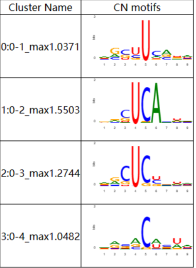
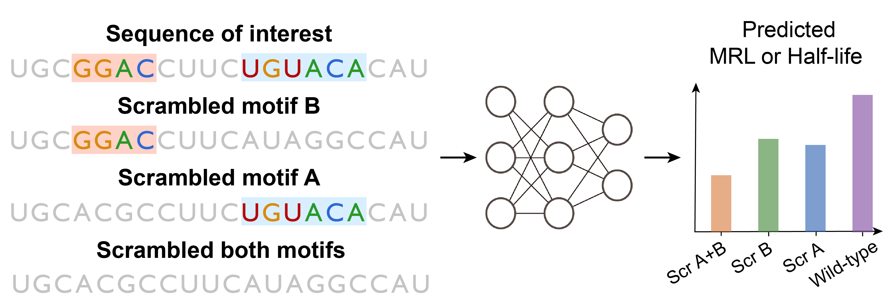

# **Unveil Cis-acting Combinatorial mRNA Motifs by Interpreting Deep Neural Network**
CombMotif is a method based on [NeuronMotif](https://github.com/wzthu/NeuronMotif) and motif mutagenesis, which not only enables the discovery of diverse and high-quality motifs but also efficiently identifies motif interactions in mRNA. By employing this method, we systematically analyzed the learned motif syntax of two types of deep learning models, namely MRL predictor and Half-life predictor. The results of our interpretation for both models align with known biological phenomena, and include some unknown motif syntax, providing novel insights for biologists. 


## Installation
### Clone this repository
```bash
git clone https://git.tsinghua.edu.cn/zengxc22/combmotif.git
cd combmotif
```
### Install dependencies
This repository is tested on Python 3.7 , PyTorch 1.10.0+cu111, [meme5.4.1](https://meme-suite.org/meme/meme-software/5.4.1/meme-5.4.1.tar.gz).
You could create a virtual environment and install dependencies with the following command.
```bash
conda create -n combmotif python=3.7
conda activate combmotif
pip install -r requirements.txt
```
### Data preparing
Data used for training and interpretation can be downloaded from [here](https://drive.google.com/drive/folders/1Ri4v3X7ghr6coqBu4JAPfIc2z1wQ1ZhP?usp=drive_link), or generated by yourself through the script in **generate_dataset** directory.
Well-trained model weights can be downloaded from [here](https://drive.google.com/drive/folders/1u14RqZuJ5PfpSNm-FD3q4VDDjzsF0PmS?usp=drive_link).
The downloaded filefolder should be placed under the root folder. 
## Model training
We trained two model, namely Half-life predictor and MRL(Mean Ribosome Load) predictor. They share the same architecture of a hybird network consists of CNN and GRU, which is proposed by Agarwal<sup><a href="#ref1">1</a></sup>.
The model weights can be downloaded  in the following links. The downloaded model weights should be placed in the **model_weights** folder under the root folder. 

| Model name | Dataset | Weights | Performance | Params | Num_layers |
| --- | --- | --- | --- | --- | --- |
| Half-life predictor | f0_c0_data0_wholeseq.h5 | [hl_predictor](https://drive.google.com/file/d/1pMejPO3XiVhDbRBDk8fw7k3wyOJiBjnZ/view?usp=drive_link) | r=0.73 | 16w | 6 |
| MRL predictor | GSM3130435_egfp_unmod_1.csv | [mrl_predictor](https://drive.google.com/file/d/11KJ_NAWT-_lbWOWEP9dpo2V7Ai6loRUU/view?usp=drive_link) | r2=0.94 | 9w | 3 |
| MRL predictor noAUG | utr_mrl_non_AUG_alldataset.csv | [noAUG](https://drive.google.com/file/d/177goactgDhSJXv997xFJRgqRW4Ng7TUK/view?usp=drive_link) | r2=0.40 | 9w | 3 |
| Half-life predictor mouse | f0_c0_data1_wholeseq.h5 | [mouse](https://drive.google.com/file/d/1XCnaVd7CVWHmX2gW61eRtpsbOFiGTZL9/view?usp=drive_link) | r=0.66 | 16w | 6 |

To train half-life predictor or MRL predictor from scratch please refer to [mrl](train_MRL_predictor/README.md) or [half-life](train_Halflife_predictor/README.md).

## Motif discovery
Here, We implement [NeuronMotif](https://github.com/wzthu/NeuronMotif)<sup><a href="#ref2">2</a></sup> by PyTorch. With neuronmotif, we have discovered numerous biologically meaningful motifs and motif combinations in mRNA. In addition, we have also explored other interpretable methods, such as [TF-MoDISco](https://github.com/jmschrei/tfmodisco-lite/)<sup><a href="#ref3">3</a></sup>, Maximum ActivationSeqlet.
Assumed that you have obtained the well-trained model weights and installed  [meme5.4.1](https://meme-suite.org/meme/meme-software/5.4.1/meme-5.4.1.tar.gz), now you can start interpreting models with NeuronMotif. 
For a quick start, here we are trying to interpret  the neuron1~neuron4 in the 2nd conv layer of Half-life predictor.   
```bash
cd motif_discovery/single_thread_script
bash main.sh 2 2 ../configs/interpreting/hl_predictor_quick_start.yaml
```
The interpretation results primarily consist of two parts. The first part is the visualization of each neuron, located in the **motif_discovery/clustering/hl_predictor/conv2-mechanic** folder. The visualization file is an HTML file, and for visualization, the JavaScript tools from the "utils" folder need to be placed in the same directory.

        --js
          --jseqlogo.js
        --conv2_neuron1.html




The second part is the comparison results of the motifs found with standard motif database by tomtom, which are stored in the **motif_discovery/tomtom_match_results/hl_predictor** folder.
If you want to interpret each neuron of half-life predictor or other models, please refer to [motif discovery](motif_discovery/README.md) for more details.

## Motif contribution
It is important to explore the contribution of each neuron to the final model predictions. We assume that if the model's prediction is higher when a neuron is activated (activation value exceeds a certain threshold) compared to when it is not activated, then we consider this neuron as a positive neuron. The motif visualized by this neuron is also considered a positive motif.
### 1.Search maxactivation of each neuron
For a quick start, we only search the max activation of the neurons in conv2 by running following command.
```bash
cd motif_contribution/script
bash run_search_maxact.sh 2 2 ../configs/interaction/hl_predictor.yaml
```
### 2.Calculate motif contribution
```bash
bash run_contribution.sh 2 2 ../configs/interaction/hl_predictor.yaml  
```
You will obtain the final results in motif_contribution/results/hf_predictor_neuron_contribution.csv. Now you should have a general understanding of whether each neuron enhances or suppresses half-life. Afterward, you can infer whether the contribution of each motif visualized by each neuron is positive or negative based on the previously interpretation results.
## Motif interaction
We applied motif mutagenesis to study the interactions between motifs. We consider two types of interactions: synergistic or antagonistic epistasis.
We only consider motif pairs discovered by NeuronMotif, as these pairs are more likely to have interactions. 
### Fragment location
First, we will identify sequences in the dataset that contain the corresponding motif pairs. For simplicity, we will only consider Conv5. 
```bash
cd motif_interaction/script

bash run_search_maxact.sh 5 5 ../configs/interaction/hl_predictor.yaml  

bash run_fragment_location.sh 5 ../configs/interaction/hl_predictor.yaml 
```
The output file can be found in motif_interaction/fragment_location/hl_predictor. Take **conv5_neuron2_fragment_location.yaml** for example.
```yaml
Seq9510_0: 86
Seq9519_0: 702
Seq9588_0: 5373
Seq9751_0: 1139
Seq9776_0: 2582
Seq9832_0: 2111
Seq9913_0: 2007
Seq9978_0: 1018
```
**Seq9510_0: 86** means that the sequence slice between the 86th and 157st nucleotides of the 9,510th sequence in the training set can activate conv5_neuron2. Because the receptive field of conv5 is 72, the length of the sequence slice is 72nt.
### Motif mutagenesis
We assume that conv5_neuron2 has learned the combination of TGTANA and GGAC, and the sequence slices in **conv5_neuron2_fragment_location.yaml** are very likely to contain the corresponding motif combination. Then we filter the sequence slices containing the motif pair from conv5_neuron2_fragment_location.yaml and perform motif mutagenesis on these sequence. Finally we perform a Wilcoxon signed-rank test on their model predictions.


```bash
bash run_scr.sh 5 0 64 ../configs/interaction/hl_predictor.yaml
```
The results can be found in motif_interaction/results/scramble_res/hl_predicto.

## References

1. <p name = "ref1">Agarwal, Vikram, and David R. Kelley. "The genetic and biochemical determinants of mRNA degradation rates in mammals." Genome Biology 23.1 (2022): 245.</p>
2. <p name = "ref2">Wei, Zheng, et al. "NeuronMotif: Deciphering cis-regulatory codes by layer-wise demixing of deep neural networks." _Proceedings of the National Academy of Sciences_ 120.15 (2023): e2216698120.</p>
3. <p name = "ref3">Shrikumar, Avanti, et al. "Technical note on transcription factor motif discovery from importance scores (TF-MoDISco) version 0.5. 6.5." _arXiv preprint arXiv:1811.00416_ (2018).</p>